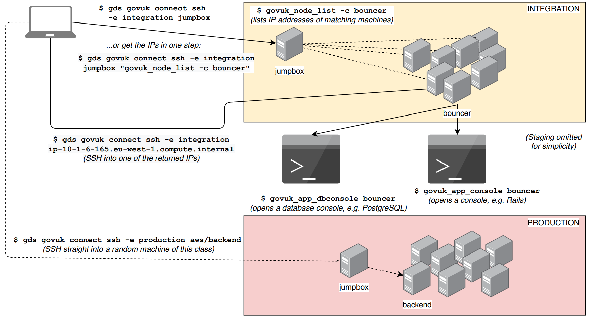

This document explains how to SSH into machines in AWS, and what commands exist
to navigate machines and applications quickly.



In AWS, there are no static hostnames, so we can't have `backend-1.backend.integration`
to SSH to like in Carrenza. EC2 instances have dynamically assigned IPs, which means
hostnames like `ip-10-1-5-53.eu-west-1.compute.internal`. Each Puppeted instance has a
"node class" (backend, frontend, ...) and the list of instances belonging to these
classes is accessible via `govuk_node_list` when logged onto the environment.

## Usage

### Local dev machine

If you know the class of machine you want, you can SSH straight from the command line:

```sh
$ gds govuk connect ssh -e staging cache
```

This will automatically SSH into a random `cache` machine on AWS.
If a class exists in multiple clouds, you will need to choose which one to SSH into:

```sh
$ gds govuk connect ssh -e staging backend
error: ambiguous hosting for backend in staging
```

You'll need to prefix it with `aws/` or `carrenza/`:

```sh
$ gds govuk connect ssh -e staging aws/backend
```

You can find out which class of machine you need (and which cloud it lives in)
by finding the corresponding [app page](https://docs.publishing.service.gov.uk/apps.html).

Alternatively, you can use the jumpbox.

```sh
$ gds govuk connect ssh -e integration jumpbox
```

### Jumpbox

The jumpbox is a special node that knows about all of the other nodes in its environment.

List the IP addresses of every node in the environment:

```sh
jumpbox$ govuk_node_list
```

This long list of IPs is not very useful on its own, but you can filter it by node class:

```sh
jumpbox$ govuk_node_list -c backend
```

And if you can't remember the names of the node classes, there's a built-in helper:

```sh
jumpbox$ govuk_node_list --classes
```

Once you have found the IP of the machine you want to SSH into, you'll need to return to
your local machine...

```sh
jumpbox$ exit
```

...and then SSH into the machine from there.

```sh
$ gds govuk connect ssh -e integration ip-10-1-5-22.eu-west-1.compute.internal
```

To avoid this cumbersome workflow, you could pass an additional argument to the CLI:

```sh
gds govuk connect ssh -e integration jumpbox "govuk_node_list -c backend"
```

### Application node

Now you're on the node running the application you want to explore. There are two main
ways of interacting with the running application.

You can start up an application console (typically Rails):

```sh
node$ govuk_app_console
```

...or you can start up a database console (typically PostgreSQL):

```sh
node$ govuk_app_dbconsole
```

These common commands, along with `govuk_node_list`, live in
[govuk-puppet](https://github.com/alphagov/govuk-puppet).

## Troubleshooting

Make sure you have been granted access. For example, if you have yet to be granted access
to production, your attempt to SSH into a production node will fail silently.
